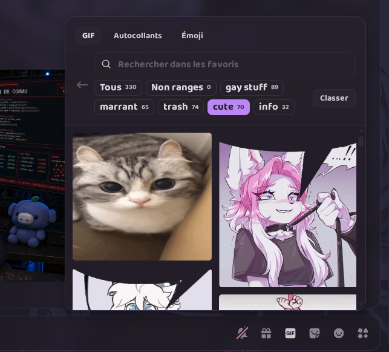
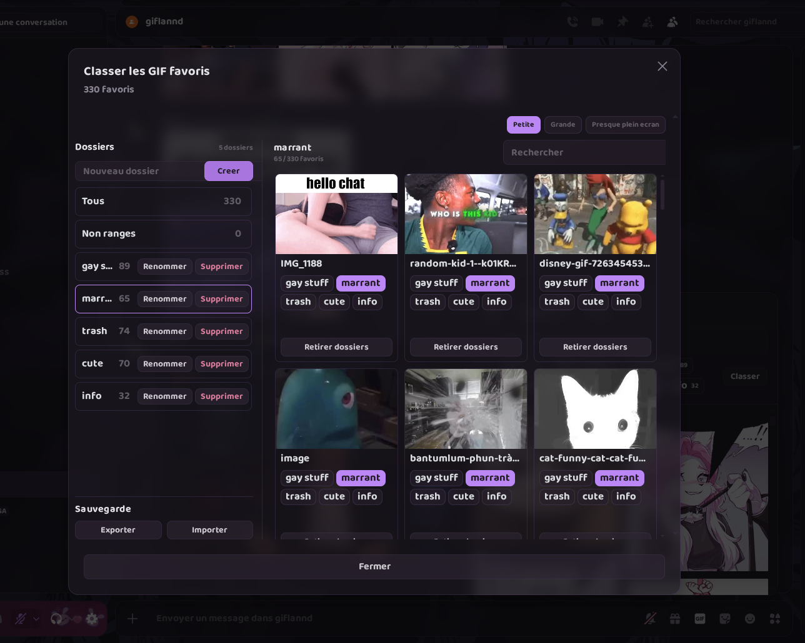
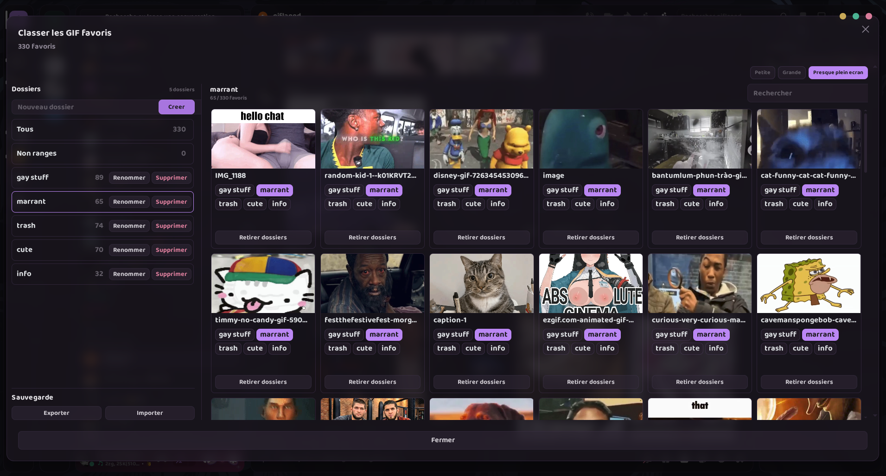

# GifFolders for Vencord / Equicord / Vesktop

GifFolders is a Vencord / Equicord userplugin that adds local folders to Discord's native favorite GIF picker.

This repository contains the current local version:

```txt
gifFolders/
└── 2.0/
    ├── README.md
    ├── index.tsx
    └── styles.css
```

## Versions

### 2.0

Current version with the updated manager UI and automatic English/French language detection.

Use:

```txt
gifFolders/2.0/
```

## Features

- Organize favorite GIFs into local folders.
- Filter favorites by `All`, `Unsorted`, or a custom folder.
- Assign one GIF to multiple folders.
- Search inside favorite GIFs.
- Create, rename, and delete folders.
- Export and import folders and all native favorite GIFs as JSON.
- Synchronize two GifFolders export files into one merged export.
- Resize the GIF manager window.
- Store data locally with Vencord `DataStore`.
- English/French UI depending on Discord/browser language.

## Screenshots







## Manual Install

Vencord custom userplugins must be installed manually in a local Vencord source checkout.

Copy the version `2.0` files into your Vencord source folder:

```txt
Vencord/src/userplugins/gifFolders/
```

The final plugin path must look like this:

```txt
Vencord/src/userplugins/gifFolders/index.tsx
Vencord/src/userplugins/gifFolders/styles.css
```

Do not copy it as:

```txt
Vencord/src/userplugins/gifFolders/2.0/index.tsx
```

## Build

From your Vencord source folder:

```sh
pnpm build --dev
```

If `pnpm` is not directly available:

```sh
corepack pnpm build --dev
```

## Vesktop

After building Vencord:

1. Open Vesktop settings.
2. Set the Vencord location to your Vencord `dist` folder.
3. Fully quit and restart Vesktop.
4. Enable `GifFolders` in Vencord plugins.

## Discord Desktop

After building Vencord:

```sh
pnpm inject
```

Then fully restart Discord and enable `GifFolders` in Vencord plugins.

## Backup

Use `Export` in the GifFolders manager to save folders, assignments, and all
native Discord favorite GIF entries as JSON.

Use `Import` to restore them later. Missing favorite GIFs are added in one
Discord settings update; favorites already present are kept unchanged.

Use `Sync exports` to select exactly two GifFolders JSON exports and download a
new merged export. Folders with the same name are combined, GIF assignments are
deduplicated, and favorite GIF entries from both files are preserved.

The backup does not contain Discord tokens. It contains the metadata and URLs
Discord needs to restore the native favorite GIF list; it does not embed or
download the GIF media files themselves.

## Terminal Import Without The Plugin UI

The `scripts/` folder contains a standalone importer that adds every GIF from a
GifFolders JSON export to the Discord account favorite GIF list, without opening
the plugin manager and without clicking each GIF manually.

It requires Node.js 18+ and a Discord user token supplied by you. It does not
need npm packages and does not extract a token from Discord, browsers, or local
files.

Portable one-file scripts are available in `standalone/`. You can copy only the
Linux or Windows file you need; cloning this repository is not required.

Portable Linux:

```sh
./import-gif-favorites-linux.sh /path/to/gif-folders-export.json
```

Portable Windows PowerShell:

```powershell
powershell -ExecutionPolicy Bypass -File .\import-gif-favorites-windows.ps1 C:\path\to\gif-folders-export.json
```

Repository launchers:

Linux:

```sh
./scripts/import-gif-favorites-linux.sh /path/to/gif-folders-export.json
```

Windows PowerShell:

```powershell
powershell -ExecutionPolicy Bypass -File .\scripts\import-gif-favorites-windows.ps1 C:\path\to\gif-folders-export.json
```

Useful options:

```txt
--dry-run   Validate the JSON and compare with the account without importing.
--yes       Skip the interactive IMPORT confirmation.
--replace   Replace the current favorite GIF list instead of merging.
```

By default, the importer merges: existing favorite GIFs stay untouched, and only
missing GIFs from the JSON are added.
