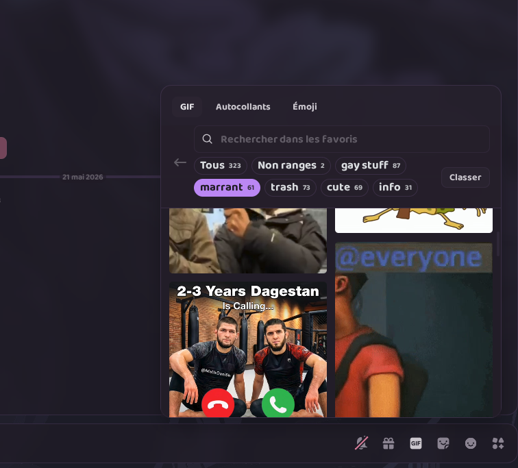
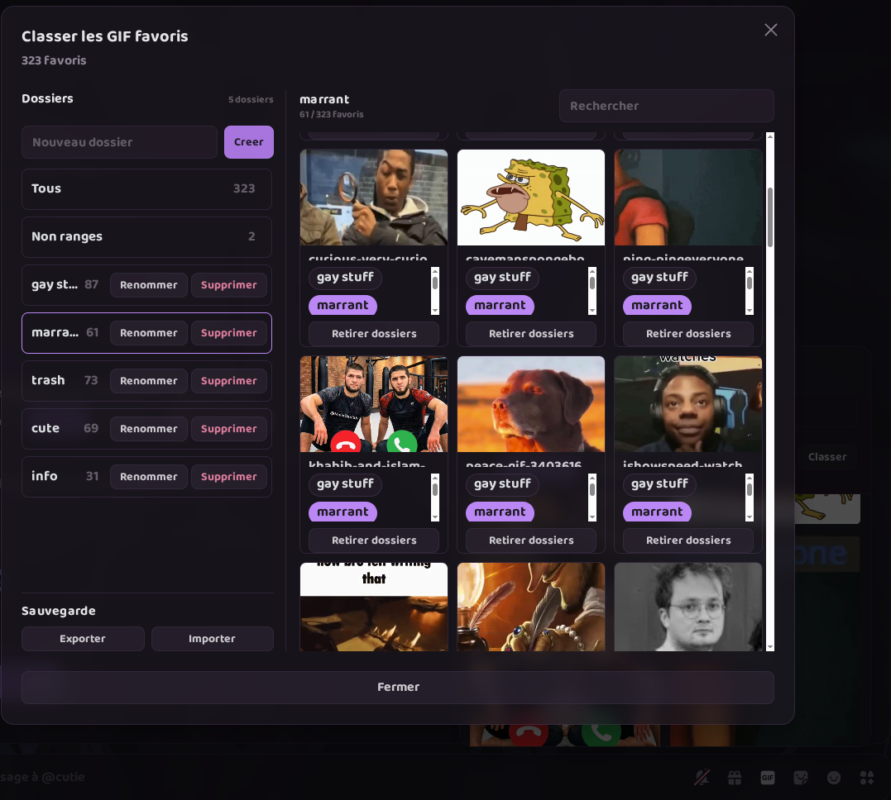

# GifFolders for Vencord / Vesktop

GifFolders is a local Vencord userplugin that adds folder management to the native Discord GIF favorites picker.

It lets you organize favorite GIFs into local folders, filter favorites by folder, and export/import your folder configuration after reinstalling Vencord or Vesktop.

The plugin UI is available in English and French. It uses French when the Discord/browser locale starts with `fr`; otherwise it uses English.

## Table of Contents

- [Screenshots](#screenshots)
- [Features](#features)
- [Important Notes](#important-notes)
- [Repository Structure](#repository-structure)
- [Prerequisites](#prerequisites)
- [Quick Install](#quick-install)
- [Manual Install](#manual-install)
- [Build for Vesktop](#build-for-vesktop)
- [Build for Discord Desktop](#build-for-discord-desktop)
- [Usage](#usage)
- [Backup and Restore](#backup-and-restore)
- [Troubleshooting](#troubleshooting)
- [Francais](#francais)
- [Official References](#official-references)

## Screenshots





## Features

- Adds folder filters directly inside the GIF favorites picker.
- Adds a manager modal to create, rename, delete, and select folders.
- Lets one GIF belong to multiple folders.
- Keeps an `All` view and an `Unsorted` view.
- Adds search inside favorite GIFs.
- Exports and imports folders and assignments as JSON.
- Stores data locally through Vencord `DataStore`.
- Supports English and French UI text.

## Important Notes

Vencord does not support one-click installation for private custom userplugins in the official build.

Custom plugins must be placed in `src/userplugins`, then Vencord must be rebuilt from source. This is required for both Discord Desktop with injected Vencord and Vesktop with a custom Vencord location.

GifFolders does not modify Discord/Tenor favorites. It only stores folder metadata and GIF-to-folder assignments locally.

## Repository Structure

Publish this structure on GitHub:

```txt
gif-folders-vencord/
|-- .gitignore
|-- README.md
|-- install-userplugin.ps1
|-- install-userplugin.sh
|-- assets/
|   |-- gif-folders-picker.png
|   `-- gif-folders-manager.png
`-- gifFolders/
    |-- README.md
    |-- index.tsx
    `-- styles.css
```

Do not publish local Vencord builds, backups, or private config folders such as `dist/`, `node_modules/`, `stable-backups/`, or `.config/vesktop/`.

## Prerequisites

Install:

- Git
- Node.js
- pnpm
- Vencord source code

Fresh Vencord source install:

```bash
git clone https://github.com/Vendicated/Vencord
cd Vencord
pnpm install --frozen-lockfile
```

If `pnpm` is not directly available but Node.js includes Corepack, use:

```bash
corepack pnpm install --frozen-lockfile
```

## Quick Install

Download or clone this repository, then run the matching command from the repository folder.

Windows PowerShell:

```powershell
powershell -ExecutionPolicy Bypass -File .\install-userplugin.ps1 -VencordPath "$env:USERPROFILE\Documents\Vencord"
```

Linux:

```bash
chmod +x ./install-userplugin.sh
./install-userplugin.sh "$HOME/Documents/Vencord"
```

The scripts copy `gifFolders/` to:

```txt
Vencord/src/userplugins/gifFolders
```

They do not build Vencord automatically. Build steps are below.

## Manual Install

1. Open your Vencord source folder.
2. Create `src/userplugins` if it does not exist.
3. Copy `gifFolders` from this repository to `src/userplugins/gifFolders`.
4. Make sure this file exists:

```txt
src/userplugins/gifFolders/index.tsx
```

Avoid nested paths like:

```txt
src/userplugins/gifFolders/gifFolders/index.tsx
```

## Build for Vesktop

From your Vencord source folder:

```bash
pnpm build --dev
```

If needed:

```bash
corepack pnpm build --dev
```

Then in Vesktop:

1. Open `Vesktop Settings`.
2. Go to `Vencord Location`.
3. Press `Change`.
4. Select the `dist` folder inside your Vencord source folder.
5. Fully close and restart Vesktop.
6. Enable `GifFolders` in Vencord plugins.

Linux Flatpak note:

```bash
flatpak override dev.vencord.Vesktop --filesystem="$HOME/Documents/Vencord"
```

Use this if Vesktop turns the selected folder into a temporary `/run/...` path after restart.

## Build for Discord Desktop

From your Vencord source folder:

```bash
pnpm build --dev
pnpm inject
```

If needed:

```bash
corepack pnpm build --dev
corepack pnpm inject
```

Restart Discord, then enable `GifFolders` in Vencord plugins.

## Usage

1. Open the Discord GIF picker.
2. Open the favorites tab.
3. Click `Organize`.
4. Create folders.
5. Assign GIFs to one or more folders.
6. Use `All`, `Unsorted`, or a folder chip to filter favorites.
7. Use search to find a specific favorite.

## Backup and Restore

Use `Export` in the GifFolders manager to download a JSON backup.

Use `Import` after reinstalling Vencord, Vesktop, or the plugin to restore folders and assignments.

The exported JSON stores only GifFolders data. It does not contain Discord account tokens or Discord/Tenor favorite data.

## Troubleshooting

`GifFolders` does not appear in Vencord plugins:

- Check that the plugin is at `src/userplugins/gifFolders/index.tsx`.
- Rebuild Vencord after copying the plugin.
- Restart Vesktop or Discord completely.
- Make sure Vesktop points to your Vencord `dist` folder.

Build command cannot find `pnpm`:

- Try `corepack pnpm build --dev`.
- Make sure Node.js and Corepack are installed.

Vesktop Flatpak forgets the Vencord folder:

- Grant file access with the Flatpak override shown in the Vesktop section.

## Francais

GifFolders est un userplugin local pour Vencord/Vesktop. Il ajoute une gestion par dossiers aux GIF favoris natifs de Discord.

L'interface du plugin est disponible en anglais et en francais. Elle passe en francais quand la langue Discord/navigateur commence par `fr`; sinon elle reste en anglais.

### Sommaire

- [Captures](#screenshots)
- [Fonctionnalites](#fonctionnalites)
- [Notes importantes](#notes-importantes)
- [Structure du depot](#structure-du-depot)
- [Prerequis](#prerequis)
- [Installation rapide](#installation-rapide)
- [Installation manuelle](#installation-manuelle)
- [Build pour Vesktop](#build-pour-vesktop)
- [Build pour Discord Desktop](#build-pour-discord-desktop)
- [Utilisation](#utilisation)
- [Sauvegarde et restauration](#sauvegarde-et-restauration)
- [Depannage](#depannage)

### Fonctionnalites

- Ajoute des filtres par dossier dans le picker GIF.
- Ajoute une modale pour creer, renommer, supprimer et selectionner les dossiers.
- Permet de ranger un GIF dans plusieurs dossiers.
- Garde les vues `Tous` et `Non ranges`.
- Ajoute une recherche dans les GIF favoris.
- Exporte et importe la configuration en JSON.
- Stocke les donnees localement via le `DataStore` de Vencord.

### Notes importantes

Vencord ne permet pas d'installer un userplugin prive avec un simple bouton dans la version officielle.

Le plugin doit etre copie dans `src/userplugins`, puis Vencord doit etre recompile depuis les sources. C'est obligatoire pour Vesktop comme pour Discord Desktop avec Vencord injecte.

GifFolders ne modifie pas les favoris Discord/Tenor. Il stocke seulement les dossiers et affectations localement.

### Structure du depot

Publie cette arborescence sur GitHub :

```txt
gif-folders-vencord/
|-- .gitignore
|-- README.md
|-- install-userplugin.ps1
|-- install-userplugin.sh
|-- assets/
|   |-- gif-folders-picker.png
|   `-- gif-folders-manager.png
`-- gifFolders/
    |-- README.md
    |-- index.tsx
    `-- styles.css
```

Ne publie pas `dist/`, `node_modules/`, `stable-backups/`, `.config/vesktop/`, ni ton dossier source Vencord complet.

### Prerequis

Installe Git, Node.js, pnpm et le code source Vencord.

Installation Vencord depuis zero :

```bash
git clone https://github.com/Vendicated/Vencord
cd Vencord
pnpm install --frozen-lockfile
```

Si `pnpm` n'est pas disponible directement :

```bash
corepack pnpm install --frozen-lockfile
```

### Installation rapide

Windows PowerShell :

```powershell
powershell -ExecutionPolicy Bypass -File .\install-userplugin.ps1 -VencordPath "$env:USERPROFILE\Documents\Vencord"
```

Linux :

```bash
chmod +x ./install-userplugin.sh
./install-userplugin.sh "$HOME/Documents/Vencord"
```

### Installation manuelle

1. Ouvre ton dossier source Vencord.
2. Cree `src/userplugins` si besoin.
3. Copie `gifFolders` vers `src/userplugins/gifFolders`.
4. Verifie que `src/userplugins/gifFolders/index.tsx` existe.

### Build pour Vesktop

Depuis le dossier source Vencord :

```bash
pnpm build --dev
```

Puis dans Vesktop :

1. Ouvre `Vesktop Settings`.
2. Va dans `Vencord Location`.
3. Clique `Change`.
4. Selectionne le dossier `dist` de Vencord.
5. Redemarre completement Vesktop.
6. Active `GifFolders` dans les plugins Vencord.

### Build pour Discord Desktop

Depuis le dossier source Vencord :

```bash
pnpm build --dev
pnpm inject
```

Redemarre Discord, puis active `GifFolders` dans les plugins Vencord.

### Utilisation

1. Ouvre le picker GIF Discord.
2. Ouvre l'onglet favoris.
3. Clique `Classer`.
4. Cree des dossiers.
5. Range les GIF dans un ou plusieurs dossiers.
6. Filtre avec `Tous`, `Non ranges` ou un dossier.

### Sauvegarde et restauration

Utilise `Exporter` pour telecharger une sauvegarde JSON.

Utilise `Importer` apres une reinstallation pour restaurer dossiers et affectations.

### Depannage

`GifFolders` n'apparait pas :

- Verifie que le plugin est dans `src/userplugins/gifFolders/index.tsx`.
- Recompile Vencord apres copie.
- Redemarre Vesktop ou Discord completement.
- Sur Vesktop, verifie que `Vencord Location` pointe vers ton dossier `dist`.

## Official References

- Vencord custom plugins: https://docs.vencord.dev/installing/custom-plugins/
- Vencord source install and build: https://docs.vencord.dev/installing/
